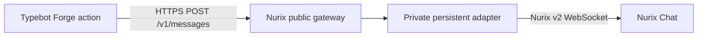

# Nurix Chat Forge block for Typebot

Canonical, submission-focused source for the proposed official Nurix Chat block.
The block runs one request-scoped Forge action while a Nurix-hosted adapter keeps
the WebSocket session alive between Typebot turns.



## Ownership boundary

This repository contains only the Forge block and Typebot synchronization tooling.
It intentionally contains no WebSocket client, DigitalOcean configuration, live
credentials, or E2E deployment code.

- Adapter source and App Platform deployment:
  [`jomashopio/nurix-typebot-adapter`](https://github.com/jomashopio/nurix-typebot-adapter)
- Hosted black-box tests and disposable Typebot environment:
  [`jomashopio/nurix-typebot-e2e`](https://github.com/jomashopio/nurix-typebot-e2e)

## Block behavior

The `Send Message` action requires:

- Encrypted Nurix Data API and Gateway API credentials.
- Widget ID and stable user ID.
- Message text.
- A stable idempotency key for the logical message. Typebot currently does not
  expose a durable Forge execution ID, so the flow must provide this value through
  a variable and preserve it across retries.

The action sends exactly one HTTPS request and never retries automatically. It maps
the returned message, conversation ID, and message ID into Typebot variables. The
private adapter gateway secret is injected by the hosted ingress and is never sent
by this block.

## Submission status

The block is pinned to the reviewed Nurix-hosted endpoint at
`https://nurix-typebot-adapter-2eazj.ondigitalocean.app/v1/messages`. An arbitrary
user-configurable endpoint is intentionally not supported because it would create
a server-side request-forgery surface in Typebot.

Typebot requires official blocks to live inside its monorepo. This repository is
the canonical source, but the final contribution must be synchronized into
`packages/forge/blocks/nurixChat` and submitted as a Typebot pull request. See the
[submission checklist](docs/typebot-submission.md).

## Local checks

Node.js 24 and npm are required.

```sh
npm ci --ignore-scripts
npm run check
```

The local suite tests the network boundary without calling a live adapter. Full
Forge and Nx validation runs after synchronization into a pinned Typebot checkout.

## License

The repository is currently unlicensed. Confirm Typebot contribution terms and the
approved Nurix logo before upstream submission.
